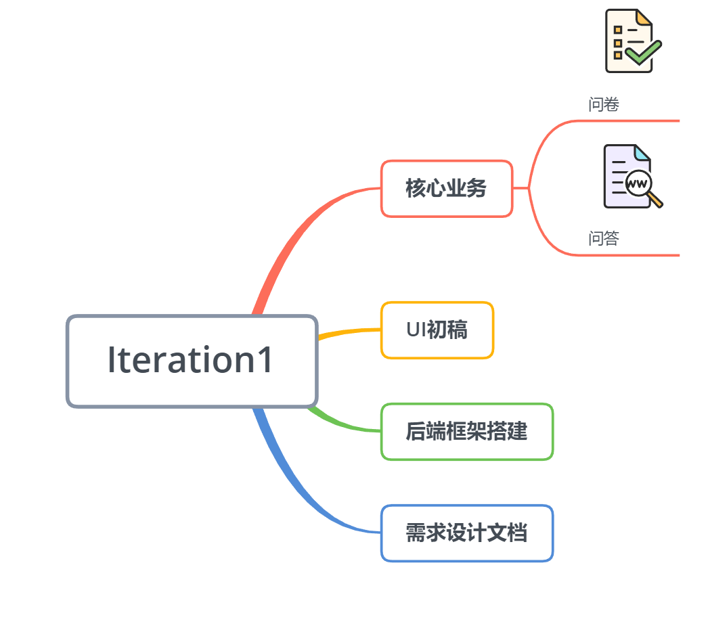

# 关于项目
{:.no_toc}

* 目录
{:toc}

| 版本 |   日期    |   描述   | 作者  |
| :--: | :-------: | :------: | :---: |
| v1.0 | 2019-5-6  |   模板   | pachi |
| v1.1 | 2019-6-27 | 完成内容 |  Ray  |
|v1.2|2019-6-30|添加图片|Ray|

## 1、Introduction

挣闲钱是一个在线任务发布平台。用户可以在平台上发布自己感兴趣的问题、问卷，也可以通过回答他人的问题，填写问卷来赚取闲钱。我们力求创造一个出色的应用，增强用户体验。

## 2、Documentation

* [需求规格说明书](software-requirement.md)
* [软件设计说明书](07-designs)

## 3、Iterations

* Inception (From 2019/03/30 Week5)

    - goal: 就产品范围、愿景展开讨论
    - work:
        - 产品调查
        - 竞品分析
        - 团队组织
        - 技术学习
        - 明确分工
        - 明确业务、项目范围
    

    
* Iteration 1  (From 2019/05/25 Week13)
    - goals: 进一步明确需求。实现项目雏形
    - Artifacts:
        - 需求设计文档雏形
        - 完成UI初稿
        - 后端框架搭建
        - 数据库、API设计

* Iteration 2  (From 2019/05/31 Week14)
    - goals: 进一步完善项目制品
    - Artifacts:
        - 前端页面框架
        - 前端登录注册功能
        - UI设计稿第二版
        - 完善后端
        - 完善需求设计文档
        - 细分业务

* Iteration 3  (From 2019/06/11Week16)
    - goals: 完成最终制品
     - Artifacts:
        - 前端完善问卷、问题功能，完成个人中心页
        - 前端部署
        - 测试
        - 补充文档
