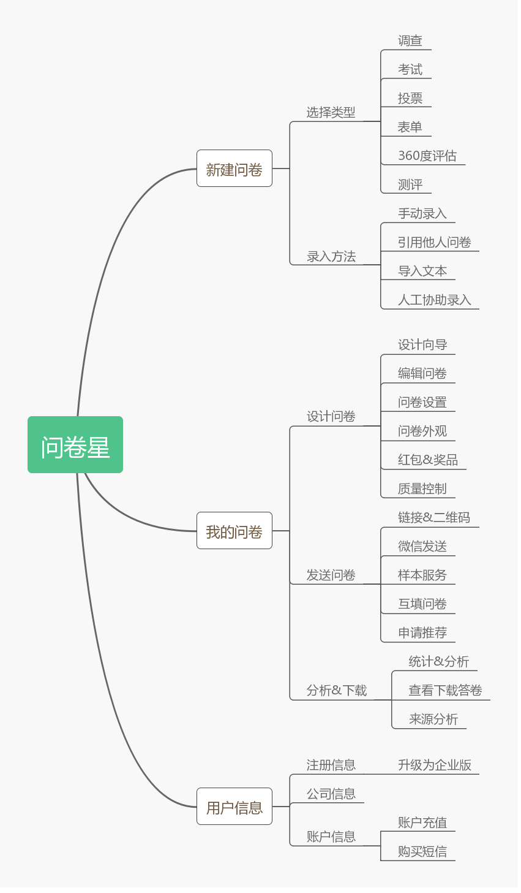
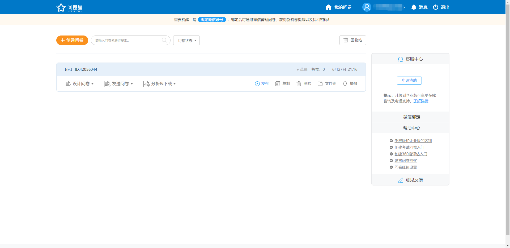
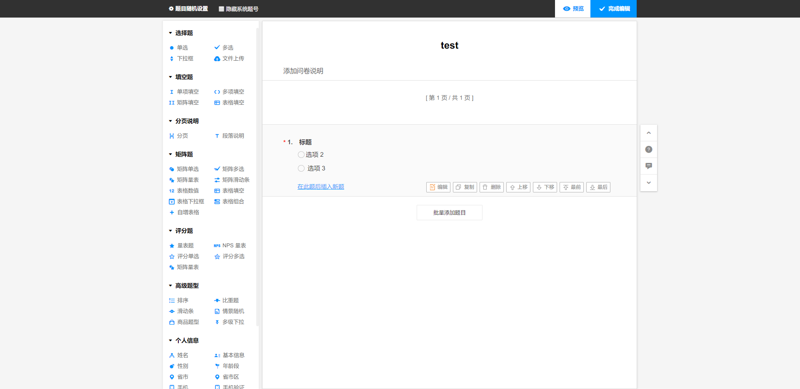
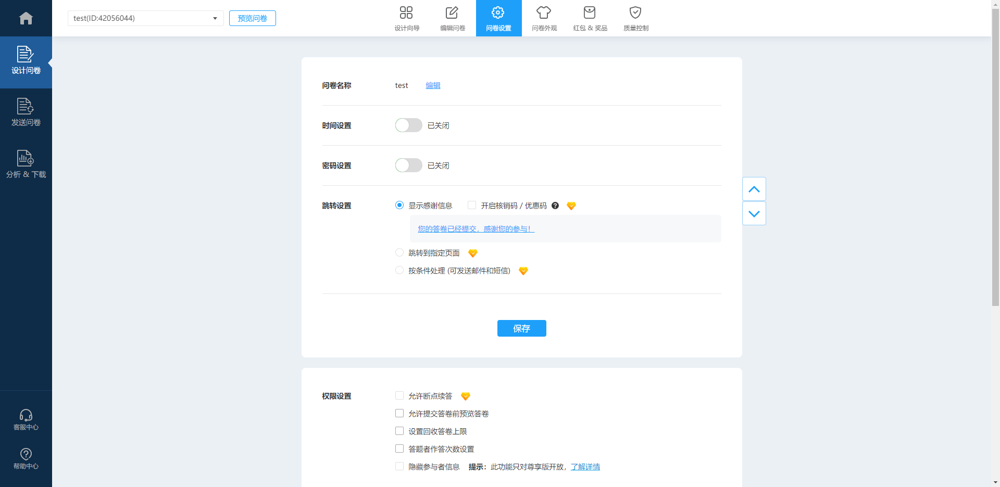
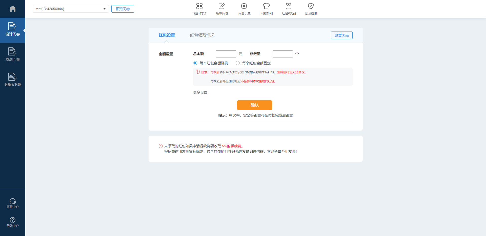
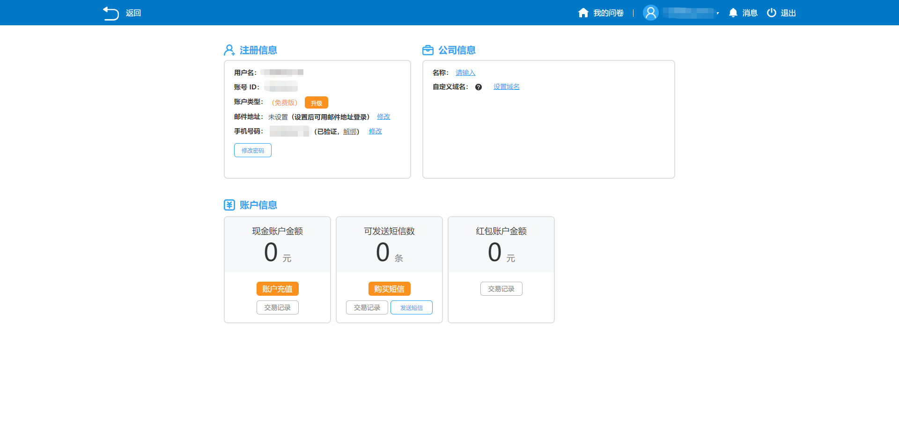
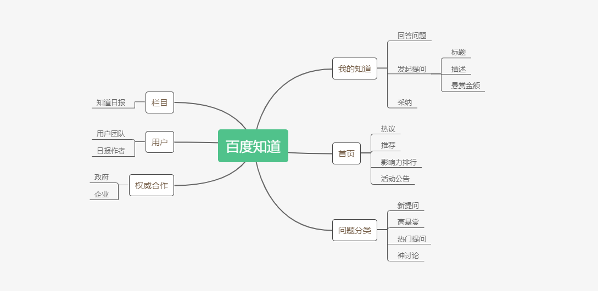
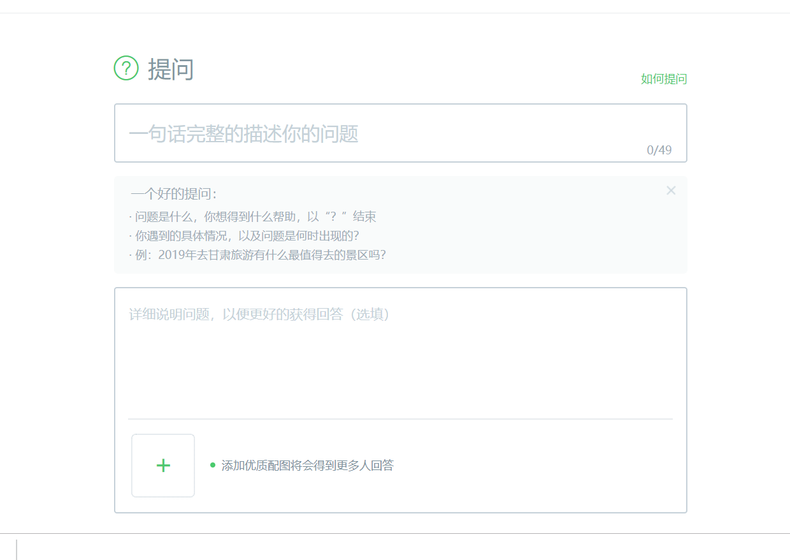
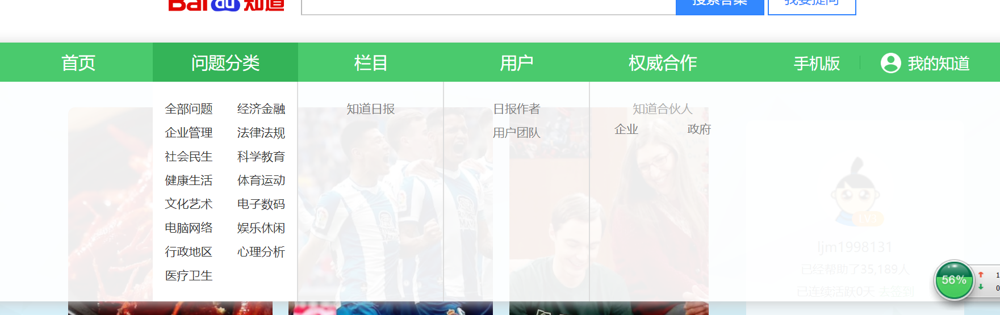

# 项目前期调研
{:.no_toc}

* 目录
{:toc}

## 背景

近些年来，随着大数据的兴起，越来越多的场合需要进行数据分析。由于数据分析等活动需要大量的人力，而一般的团队并不具备这样的人力资源，他们会选择将任务发布到网络上进行众包。对于组织机构，这是一种节约成本的运作模式；而对于一般的群众，这是一个能够轻松赚取利润的活动。因此众包做任务成为了一种受欢迎的方式。

在当前比较知名的做任务的应用中，并没有太多采用这种众包的模式。而对于问答类的产品，虽然有的具有奖励机制，但大部分还是存在着明显的缺点。而且，在活跃的大学社区中，没有一款功能完整的众包产品能方便大学生之间的互助互惠。因此，设计一款具有竞争力的产品就非常必要。

## 竞品分析

### 问卷星

问卷星是一个知名的在线问卷调查、测评、投票平台，提供在线设计问卷、采集数据、自定义报表、调查结果分析系列服务。与传统调查方式和其它调查网站或调查系统相比，问卷星具有快捷、易用、低成本的明显优势。

#### 功能框架

#### 优点
* 问卷编辑器功能强大，题目类型非常丰富
* 整体流程清晰
* 含有质量控制、时间控制等高级功能

#### 缺点
* 部分功能需要付费升级才能使用，例如给问卷设置奖品
* 生成问卷红包后无法修改，且退款需收取5%的手续费

## 附件

### 问卷星
我的问卷

问卷编辑

问卷设置

红包功能

个人中心

### 百度知道

百度知道是一个基于搜索的互动式知识问答分享平台。它使用用户自己根据具有针对性地提出问题，通过积分奖励机制发动其他用户，来解决该问题的搜索模式。 同时，这些问题的答案又会进一步作为搜索结果，提供给其他有类似疑问的用户，达到分享知识的效果。
与传统的知识问答平台相比，百度知道的优势就在于和搜索引擎的完美结合，实现搜索引擎的社区化。同时也具有免费，全面，鼓励机制好的优势。

#### 功能框架

#### 优点
* 问题类型丰富，回答全面
* 与搜索引擎完美结合
* 激励机制强大

#### 缺点
* 回答者良莠不齐
* 由于激励机制的原因，有很多恶意蹭分的回答者
* 有少量广告

## 附件

### 百度知道

提问

回答

首页
