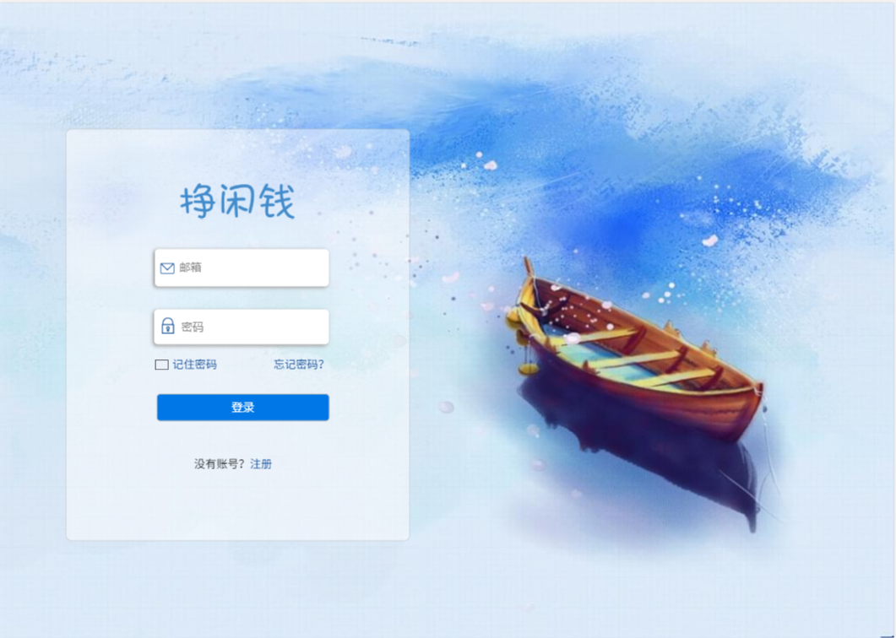
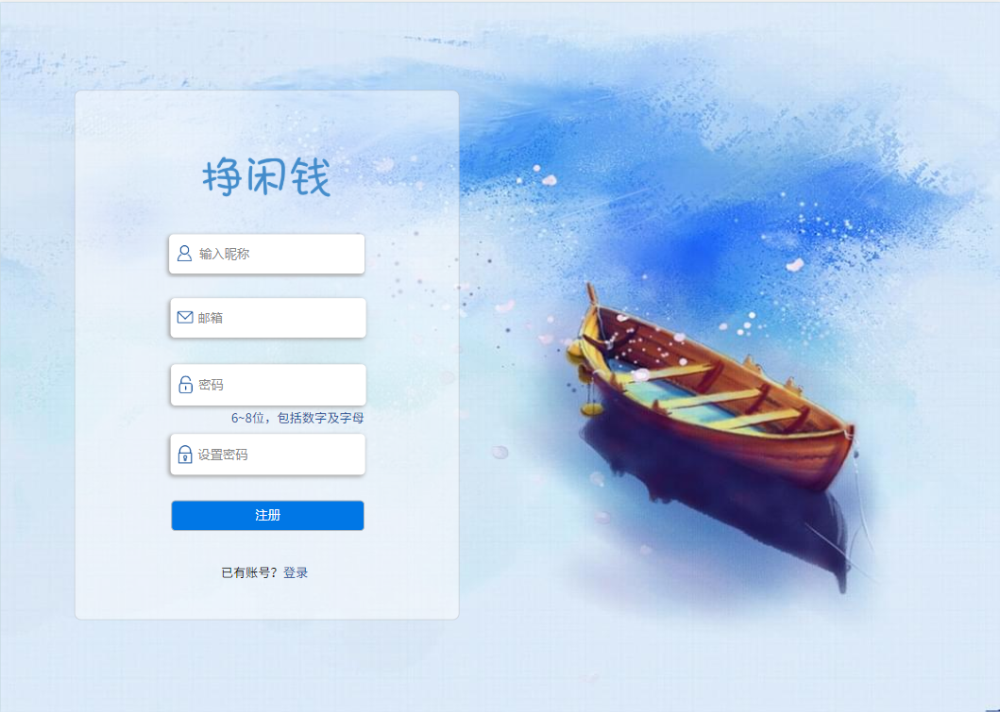

# 界面设计
{:.no_toc}

* 目录
{:toc}

| 版本 |   日期   | 描述 | 作者  |
| :--: | :------: | :--: | :---: |
| v1.0 | 2019-5-31 | 登录、注册页面设计初稿 | zhulinyin |
| v1.1 | 2019-6-2 | 修改了邮箱、密码图标，增加了注册时输入昵称的输入框 | zhulinyin |

## 1、Introduction
**设计师：李江涛**

- [配色方案参考配色表](http://tool.c7sky.com/webcolor/#hue_6)

## 2、登录

## 3、注册

