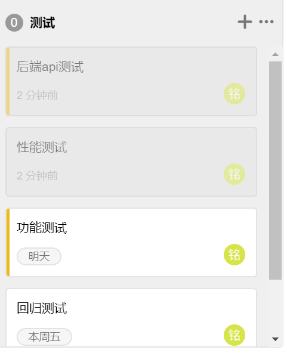

单元测试：
 - 针对各个用例的源代码，编写测试用例
 - 可考虑引入单元测试工具作为辅助：
    - mocha，可以运行在浏览器环境以及Nodejs环境中

系统测试：以 **《需求规格说明书》** 为标准，测试包括随机测试、功能测试、压力测试、容量测试、性能测试和安全测试等，验证单元测试和集成测试的正确性，检查产品的各个功能，并测试产品的健壮性、安全性、可维护性等

 - 目前拟用以下工具

   - Postman：测试静态和动态资源（静态文件、数据库...），功能测试
   - Jmeter : 压力测试.

测试管理工具： Tower
测试分为：后端api测试，性能测试，综合测试，回归测试（不一定有）

设想的测试工作流程：
  1. 针对每个用例，画出它的程序控制流图，考虑到所有的路径，分支，设计一个高覆盖率的单元测试
    - 前端测试：coded test UI
    - 后端测试：引用上述提到的js测试工具（mocha等）

  2. 系统测试
    - 压力测试
    - 性能测试
    - 安全测试

