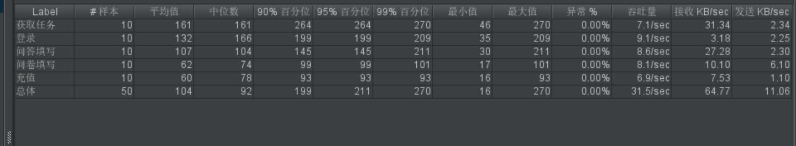
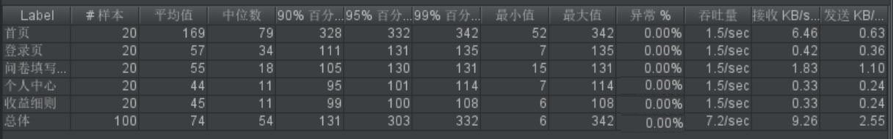
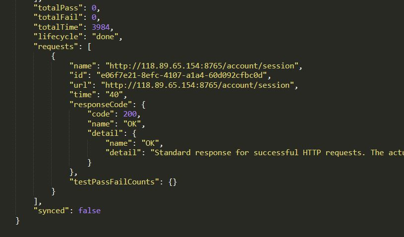

# 综合测试报告

| 项目名称 | 测试时间 | 测试员 | 测试内容 |
| -------- | -------- | ------ | -------- |
| Earning Money | 2019.6.25 | 李佳铭 | 性能测试 |
| Earning Money |  |  | 系统测试 |

## 1 测试概要
### 1.1测试用例设计
#### 1.1.1功能性
[用例详细说明](../UseCases/README.md)

- 主要用例：客户端点餐、商家端订单管理、商家端菜品管理
- 次要用例：客户端查看历史订单、商家端注册登录、商家端生成二维码

#### 1.1.2易用性

- 操作按钮提示信息正确性，一致性，可理解性
- 限制条件提示信息正确性，一致性，可理解性
- 必填项标识
- 输入方式可理解性

#### 1.1.3可靠性

- 突然断网
- 非法输入
- 工具栏刷新和返回

#### 1.1.4性能
- 功能点上的并发测试
- 接口处的并发测试

### 1.2测试环境与配置
#### 1.2.1功能测试
 - 商端设备：Chrome + Win10

#### 1.2.2性能测试
 - 后端服务器地址 http://118.89.65.154:8765
 - 测试工具：Postman
 - 测试设备：Win10
 - 测试环境：Java8.0，jdk1.8.0， Jmeter5.1.1

 ### 1.3测试方法和工具

本次系统测试用例设计主要采用黑盒测试方法。其中单元测试由开发人员直接完成；功能模块采用的是非渐增式测试，重点在模块间接口和数据提取。具体方法有等价类划分、边界值划分、正交分解、因果图分析和错误猜测；在系统测试时依据业务流程采用回归测试，重点在于业务流程。

性能测试使用接口测试工具Postman,并最后通过接口

## 2 测试内容和执行情况

| 模块 | 用例数 | 用例通过个数 | 问题数 |
| ---- | ------ | ------------ | ------ |
| 功能测试 | 32 | ? | ? |
| 性能测试 | 20 | 20 | 0 |
| 其他测试项 | ? | ? | ? |

### 3.1功能
#### 3.1.1注册登录

| 功能 | 基本要求 | 测试情况 | 通过(Y/N) |
| ---- | -------- | -------- | --------- |
| 注册 | 输入必要信息，经过格式检查，产生一个可登录账户 | 已实现 | Y |
| 登录 | 输入正确的账号和密码，跳转到首页，获得问卷信息和问答信息 | 已实现 | Y |
| 退出登录 | 能正常退出，并保证登出前的操作得到保存。再次登陆，验证之前发布回答问卷，问题的操作是否生效 | 已实现 | Y |

#### 3.1.2问卷管理

| 功能 | 基本要求 | 测试情况 | 通过(Y/N) |
| ---- | -------- | -------- | --------- |
| 发布 | 可以使用闲钱币来发布问卷，问卷中可以添加不同种类的问题，钱不够不可发行 | 已实现 | Y |
| 填写 |  可以正确填写问卷，填写后获得闲钱币并且不可以再次填写，过期的问卷不可再填写 | 已实现 | Y |
| 获得统计信息 | 可以获得自己发布的问卷的统计信息 | 已实现 | Y |
| 删除 | 可以删除未完成的问卷，删除后退回剩余闲钱币 | 已实现 | Y |

#### 3.1.3问答管理

| 功能 | 基本要求 | 测试情况 | 通过(Y/N) |
| ---- | -------- | -------- | --------- |
| 发布 | 可以使用闲钱币来发布问题，并添加描述，钱不够不可发行 | 已实现 | Y |
| 填写 | 可以正确填写回答，过期的回答不可再填写，不可多次填写 | 已实现 | Y |
| 采纳 | 可以采纳回答，并将闲钱币转到回答者账号上 | 已实现 | Y |
| 删除问题 | 可以正确删除问题| 已实现 | Y |
| 删除回答 | 可以正确删除未被采纳的回答| 已实现 | Y |

#### 3.1.4任务获取

| 功能 | 基本要求 | 测试情况 | 通过(Y/N) |
| ---- | -------- | -------- | --------- |
| 获取 | 在首页可以获得最近的问卷和问答，并且可以过滤问卷或问答，分页显示良好 | 已实现 | Y |
| 个人中心获取 | 在个人中心中可以获得与自己相关的任务，并且查看相关的状态，分页显示良好 | 已实现 | Y |

#### 3.1.5金钱管理

| 功能 | 基本要求 | 测试情况 | 通过(Y/N) |
| ---- | -------- | -------- | --------- |
| 充值 | 可以使用金钱充值闲钱币 | 已实现 | Y | 
| 提现 | 可以将闲钱币提现为金钱 | 已实现 | Y |
| 查询 | 可以查询自己的金钱流动，分页显示良好 | 已实现 | Y |

### 3.2性能

*注：测试系统在预定环境和负载下的响应速度、通信效率、设备效率、执行效率。

性能测试主要分为后端性能测试以及网页性能测试，其中一部分的网页性能测试包括后端性能测试。

#### 3.2.1功能点

| 用例名称 | 基本要求 | 并发数 | 是否通过 |
|-------|-------|-------| --- |
| 用户登录 | 多个用户同时登录 | 100 | Y |
| 问卷填写 | 多个问卷同时填写 | 100 | Y |
| 问答填写 | 多个问答同时填写| 100 | Y |
| 问卷发布 | 多个用户同时发布问卷 | 100 |Y|
| 问答发布 | 多个用户同时发布问答| 100 |Y|
| 充值 | 多个用户同时充值 | 100 |Y|
| 获取任务列表（包括问卷和问答） | 多个用户同时获取任务列表 | 100 |Y|

#### 3.2.2接口

| 网页名称 | 并发数 | 是否通过 |
| --- | --- | --- |
| 注册页 | 100 | Y |
| 登录页 | 100 | Y |
| 首页 | 100 | Y |
| 问卷列表页 | 100 | Y |
| 问答列表页 | 100 | Y |
| 个人中心页 | 100 | Y |
| 问答详情页 | 100 | Y |
| 回答问题页 | 100 | Y |
| 填写问卷页 | 100 | Y |
| 发布问题页 | 100 | Y |
| 发布问卷页 | 100 | Y |
| 收益细则页 | 100 | Y |
| 问卷统计结果页 | 100 | Y |

#### 3.2.3参数设置
| 参数名| 值|
| ---- | --- |
| 脚本循环次数 | 无限 |
| 并发用户数 | 10/100 |
| 真实客户端数量 | 1 |
| 脚本录制方法 | 自动 |
| 模拟路线类型 | 10/100M以太网 |

#### 3.2.4性能测试具体结果

##### Jmeter参数解释

- Label：JMeter的每个HTTP Request的name属性值
- Samples：请求数，表示本次测试一共发出了多少个请求
- Average：单个HTTP Request的平均响应时间
- Median：50%用户的响应时间
- 90% Line：90%用户的响应时间
- 95% Line：95%用户的响应时间
- 99% Line：99%用户的响应时间
- Min：最小响应时间
- Max：最大响应时间
- Error%：错误率，即错误请求数 / 请求总数
- Throughtput：吞吐量，每秒完成的请求数
- Received KB/Sec：每秒从服务器端接收到的数据量
- Sent KB/Sec：每秒发送到服务器端的数据量

##### 测试聚合报告截图

我们使用了postman和jmeter进行了性能测试，由于使用postman进行了太多测试导致访问较大，腾讯云可能会对服务器进行封禁（已经被封了一次），所以我们没有生成100线程下的聚合报告，只生成了10线程下的聚合报告。实际上，我们使用了postman完成了所有接口在100线程下的并发测试。

 - Jmeter后端性能测试
并发数量为10时，部分API的测试报告：

 - Jmeter网页性能测试

并发数量为10时，部分网页接口的测试报告：

 - postman接口测试
 并发数量为100时的测试报告：

### 3.3其他用例测试结果
可靠性和易用性测出以下问题：

## 4 缺陷的统计与分析

### 4.1缺陷汇总

共有32个缺陷，具体见tower

### 4.2性能分析

从报告可以看出，正常情况下，后端api返回100个请求平均用时2.7秒，且错误率接近0%。对于10个线程，它平均用时仅0.1s。由于我们的技术是面向比较少的客户，所以我们服务器的性能是完全足够的。唯一的问题就是收到的访问太多可能会导致腾讯云服务器封号，如果条件允许，我们可以采取更为大型的服务器。

