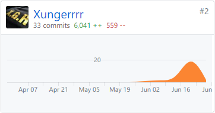

# 16340109 - Xungerrrr Final Report

## 个人小结

作为产品经理，我主要负责项目的前期调研、需求分析，也参与了用例的设计和项目的管理工作，工作成果主要体现在项目文档上。

第一次当这样的角色，刚开始对自己的职责还不是很明确，导致需求分析的进度拖了一点后腿。后来随着课程的学习，慢慢对整个用例建模的方法有了清晰的认识，也及时补充完善了需求规格的内容。由于许多内容都是初次接触，因此在学习过程也花了不少时间。

以前都知道开发前的分析和设计很重要，但以往做的开发项目都是边想边做，思路天马行空，结果到最后不得不放弃一些不实际的内容。课程上讲的设计方法也往往是纸上谈兵。通过做这个系分项目，我才对软件工程的系统过程有了一个清晰的概念，明白一个成熟完善的软件产品，除了有出色的代码，还应该有完善的调研、设计、管理等过程，学到的内容还是很实用的。

## PSP2.1 统计表

| PSP阶段                    | 时间 (%) |
| -------------------------- | ------- |
| **计划**                   | **10** |
| · 估计任务时间              | 10 |
| **开发**                   | **80** |
| · 分析需求                  | 40 |
| · 生成设计文档              | 15 |
| · 设计复审                  | 15 |
| · 具体设计                  | 10 |
| **报告**                   | **10** |
| · 个人报告                  | 8 |
| · 计算工作量                | 2 |
| **合计**                    | **100** |

## 主要工作清单：

* 通过用例建模进行需求分析；
* 分析产品前景，对相似产品进行研究；
* 具体设计部分用例。

## Git统计

## 特别致谢

前端: Yuuoniy、Ray和zhulinyin

后端：pachi

UI/UX设计：zhulinyin

测试：smiletomisery

感谢团队成员共同完成项目。

感谢老师和TA对这门课的辛勤付出。