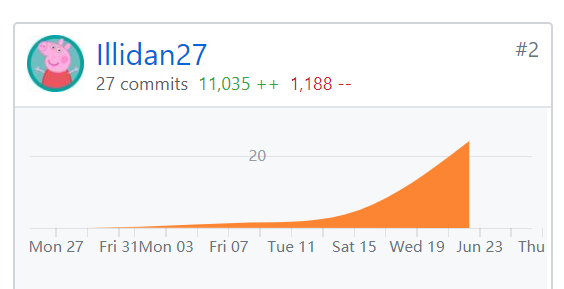

# 16340114 - illidan27 Final Report

## 个人小结

作为小组组长，我主要负责团队会议的组织，同时还参与了前端开发。

在会议中，我会列出会议目标和大纲，与成员一起讨论现阶段需要关注的问题，力求在会议上讨论出结果，也会发起头脑风暴，发掘项目新思路。当然会后的记录整理工作是由我完成的。

在前端工作的部分，我主要负责用户管理和问卷模块的编写。在问卷模块中，由于后端提供的数据和前端控件需要的数据格式不同，这一模块的主要工作量就在数据处理上。有了Yuuoniy提供的框架以及zhulinyin的UI设计文稿，我可以更专注在数据处理这件事上。在工作过程中觉得最难的部分是调整UI，前端使用的是第三方控件，而非原生控件，在编写样式时很容易被第三方控件的样式所覆盖，导致页面未能达到预期的效果。好在数据处理的难题被攻克了，和UI设计师沟通会也对UI做了调整，最终得到一个不错的成品。

这次项目中自己学到了不少知识，在前端方面还需要继续学习。

## PSP 2.1 统计

| PSP阶段                    | Time (%) |
| -------------------------- | ------- |
| **计划**                   | **10**  |
| · 学习技术         | 10      |
| **开发**                   | **75** |
| · 明确需求             | 10      |
| · 分析后端提供数据     | 10      |
| · 编写页面框架           | 15      |
| · 编写数据处理逻辑       | 25      |
| · 调整样式             | 15      |
| **文档**                 | **15** |
| · 会议记录整理 | 10      |
| · 视频录制与编辑 | 2      |
| · 总结 | 3       |
| **合计**            | **100**  |

## 主要工作清单：

* 组织团队会议
* 编写前端用户管理模块、问卷模块

## Git统计

## 特别致谢

前端: Yuuoniy、zhulinyin

后端：pachi

UI/UX设计：zhulinyin

测试：smiletomisery

外部技术支持：sanfeng

感谢团队成员为项目付出的努力，以及老师和TA们的谆谆教诲
