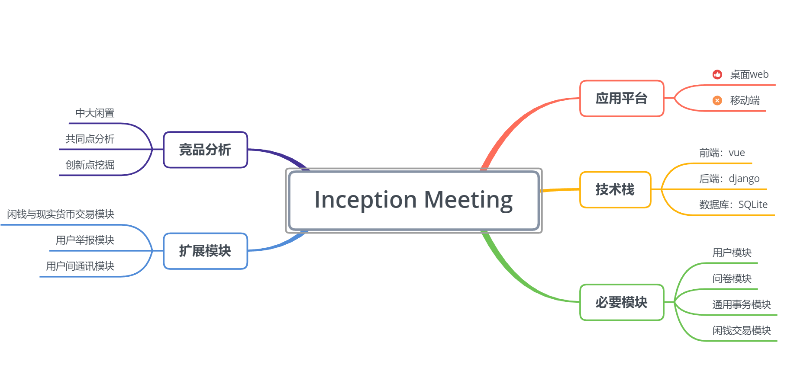

# Inception meeting

|事项|描述|
|---|---|
|会议时间|2019/03/30 Week5|
|会议成员|全员|

## 会议内容
* 确定应用的主要平台
  * 将应用定位为桌面端web应用
    * 团队对移动端web应用不熟悉
    * 将团队精力放在创意开发中，而不是花费在熟悉新平台
* 确定技术栈
  * 选用vue作为前端框架
    * 学习曲线对成员友好
    * （团队有vue大佬
  * 选用django作为后端web框架
    * 开发速度快
  * 选用sqlite作为数据库
    * 功能满足的情况下，尽量选择轻量级别
* 确定分工
  * 分工情况详见[此链接](02-team-profile)
* 初步确定模块
  * 经讨论后必要的模块有：用户模块、问卷模块、通用事务模块、闲钱交易模块
  * 扩展模块为：闲钱与现实货币交易模块、用户举报模块、用户间通讯模块
* 进行竞品分析
  * 与本团队产品相似的产品有：中大闲置
  * 初步分析：中大闲置只有信息发布功能，联系、交易等只能由用户自行解决使用第三方软件进行
  * 会后进一步寻找相似产品，找出共同点，并尝试提出本团队产品的创新点
