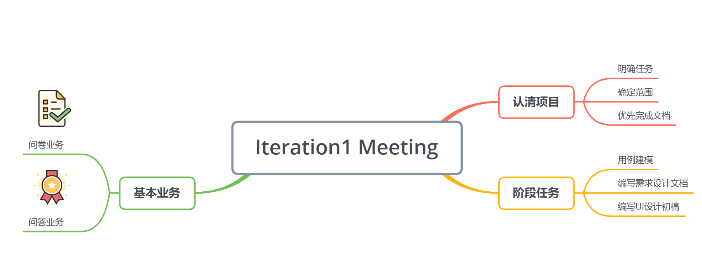

# 第一次迭代会议记录

|事项|描述|
|---|---|
|会议时间|2019/05/25 Week13|
|会议成员|全员|

## 会议目的

* 明确项目计划与确定基本业务

## 会议内容

* 明确项目任务，确定产品范围，优先完成文档的编写，使用需求设计文档指导代码编写

* 确定项目的基本业务：

  * 以问卷填写为核心业务
    * 问卷类型定位为调查型问卷
  * 动态问卷，如为数据集打标签，需要考虑到检验有效性的问题，故将动态问卷作为扩展业务
  * 在“帮取快递”、“有赏问答”、“失物招领”、“代排队”四个业务中选取一个作为辅助业务
* 使用用例建模方法对这四个候选业务进行分析
    * “帮取快递”、“失物招领”、“代排队”涉及线下活动，业务的范围较大，需要考虑任务有效完成和欺骗性行为的检查，不适合将其当作项目辅助业务。最终选取“有赏问答”作为项目第二核心业务。

## 讨论结果

* 第一次迭代先只关注happy path，暂不考虑参与者的恶意行为。
* 控制产品范围，避免需求越来越多。
* Iteration1阶段的任务：
  * 进行用例建模，绘制用例图、领域图等
  * 编写需求设计文档
  * 编写UI设计初稿

