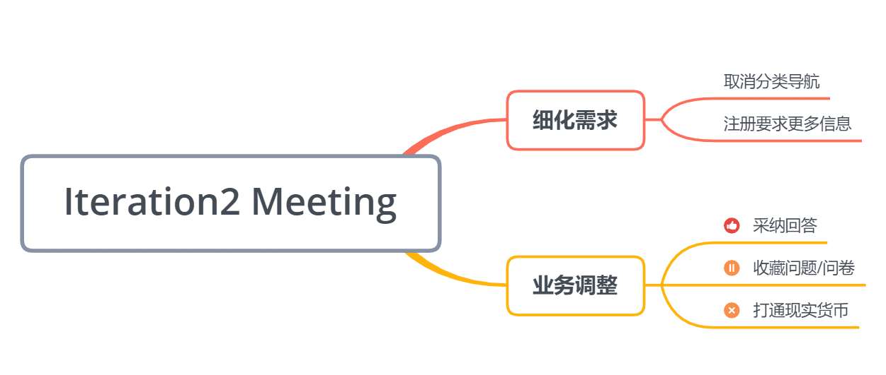

# 第二次迭代会议记录

|事项|描述|
|---|---|
|会议时间|2019/05/31 Week14|
|会议成员|全员|

## 会议目的
* 解决第一轮迭代过程中遇到的问题

## 会议内容

* 针对UI设计稿进一步细化需求
  * 	取消主页中的分类导航，将分类作为标签添加到任务的属性中
  * 	注册应提供邮箱、密码、昵称信息

* 对一些业务的划分：

  * 将问题收藏功能定为可选业务

  * 采纳问题回答为必选业务

  * 货币系统仅限于虚拟货币，暂无与现实货币打通的计划

