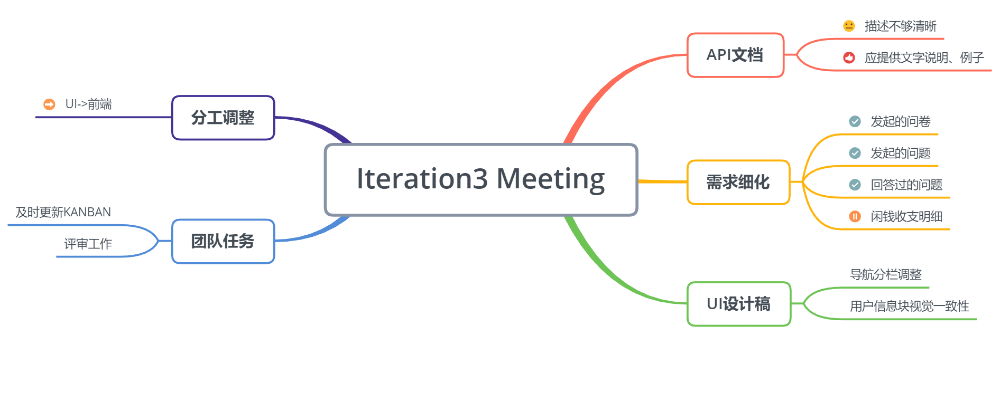

# 第三次迭代会议记录

|事项|描述|
|---|---|
|会议时间|2019/06/41 Week16|
|会议成员|全员|

## 会议目的
* 解决前后端对接问题

## 会议内容

* 分析api文档存在的问题
  * 	存在的问题：api文档只有格式要求，缺少说明、例子，需要前端人员逐一分析
  * 	解决方法：测试人员使用postman进行测试，同时与后端成员沟通，给出用例、说明

* UI设计稿调整：

  * 主页分为“全部”、“问答”、“问卷”三个导航分栏

  * 注册页、个人信息页信息调整，保持视觉一致性

* 团队任务提醒

  * 提醒成员及时更新KANBAN

  * 提醒成员完成评审工作
* 需求细化

  * 个人中心页应该包括用户发起的问题、问卷、回答过的问题
  * 个人中心还应该包括闲钱收支明细，由于工作量过大，这一项待做
* 分工调整
  * 前端任务缺口较大，把UI设计师调到前端工作

