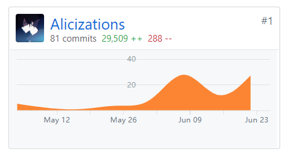

## 团队分工

[分工表](https://code-flows-in-you.github.io/Dashboard/02-team-profile#2%E5%9B%A2%E9%98%9F%E5%88%86%E5%B7%A5)

### 小组分工与贡献率

|学号|姓名|分工|贡献率（合计100%）|
|:-|:-|:-|:-|
|16340114|李泓睿（组长）|需求分析、前端开发||
|16340109|黎汛言|项目管理、需求分析||
|16340115|李佳铭|后端开发、测试||
|16340116|李家俊|架构设计、后端开发||
|16340117|李江涛|UI/UX设计、前端部分功能开发||
|16340141|林妙倩|前端开发||

### 制品与贡献率

||制品|李泓睿|黎汛言|李佳铭|李家俊|李江涛|林妙倩|
|:-|:-|:-|:-|:-|:-|:-|:-|
|源码|

<table>
  <tr>
    <th></th>
    <th>制品*</th>
    <th>李泓睿</th>
    <th>黎汛言</th>
    <th>李佳铭</th>
    <th>李家俊</th>
    <th>李江涛</th>
    <th>林妙倩</th>
  </tr>
  <tr>
    <td rowspan="2">源码</td>
    <td>前端</td>
    <td></td>
    <td></td>
    <td></td>
    <td></td>
    <td></td>
    <td></td>
  </tr>
  <tr>
    <td>后端</td>
    <td></td>
    <td></td>
    <td></td>
    <td></td>
    <td></td>
    <td></td>
  </tr>
  <tr>
    <td>交互</td>
    <td>UI设计稿</td>
    <td></td>
    <td></td>
    <td></td>
    <td></td>
    <td></td>
    <td></td>
  </tr>
  <tr>
    <td rowspan="4">测试</td>
    <td>API测试</td>
    <td></td>
    <td></td>
    <td></td>
    <td></td>
    <td></td>
    <td></td>
  </tr>
  <tr>
    <td>性能测试</td>
    <td></td>
    <td></td>
    <td></td>
    <td></td>
    <td></td>
    <td></td>
  </tr>
  <tr>
    <td>系统测试</td>
    <td></td>
    <td></td>
    <td></td>
    <td></td>
    <td></td>
    <td></td>
  </tr>
  <tr>
    <td>回归测试</td>
    <td></td>
    <td></td>
    <td></td>
    <td></td>
    <td></td>
    <td></td>
  </tr>
  <tr>
    <td rowspan="3">文档</td>
    <td>前期调研</td>
    <td></td>
    <td></td>
    <td></td>
    <td></td>
    <td></td>
    <td></td>
  </tr>
  <tr>
    <td>需求规格</td>
    <td></td>
    <td></td>
    <td></td>
    <td></td>
    <td></td>
    <td></td>
  </tr>
  <tr>
    <td>架构设计</td>
    <td></td>
    <td></td>
    <td></td>
    <td></td>
    <td></td>
    <td></td>
  </tr>
</table>

## Git统计 

- @pachi (Server & API Document & Dashboard)

  

    
