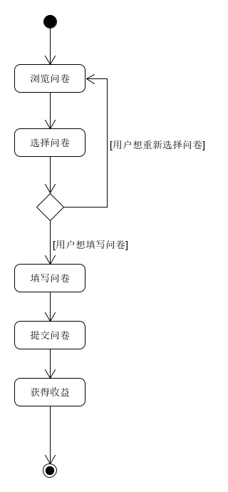

# 用例：完成问卷任务

## 用例文本

|用例名称|完成问卷任务|
|:-:|:-:|
|范围|Web网页|
|级别|用户目标|
|主要参与者|用户|
|涉众及其关注点|用户：希望帮助他人填写问卷，获得收益|
|前置条件|有人发布了问卷；问卷还有剩余份数|
|后置条件|用户填写完要求的内容，即可获得收益|
|主成功场景|用户在问卷列表浏览问卷；用户选择想要填写的问卷；用户填写内容并提交；系统将该数据写入数据库；用户获得收益|
|扩展|同一个用户点击填写过的同一份问卷，提示已经填写|
|特殊需求|显示问卷填写进度|
|发生频率|经常发生|
|未决问题|如何过滤随机填写等无效问卷|

## 活动图
