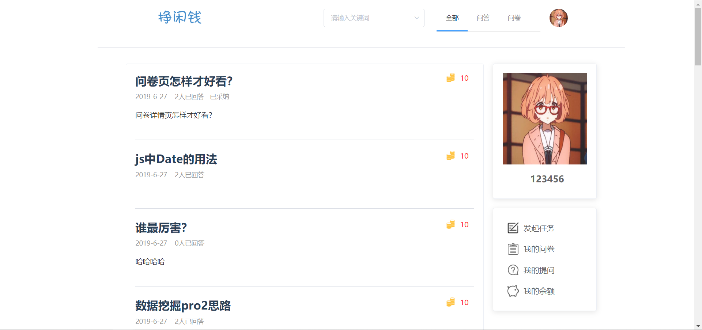
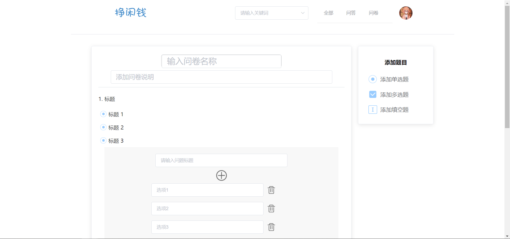
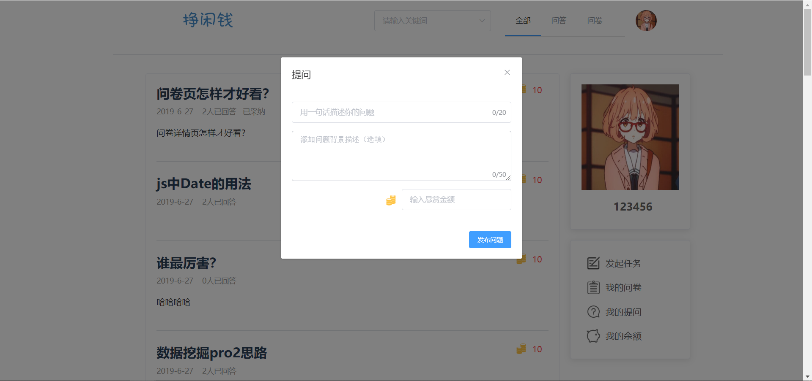
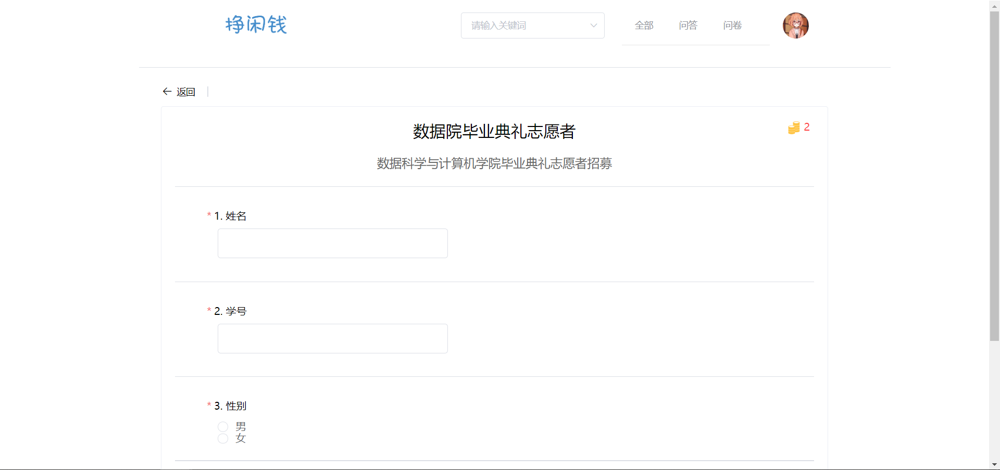
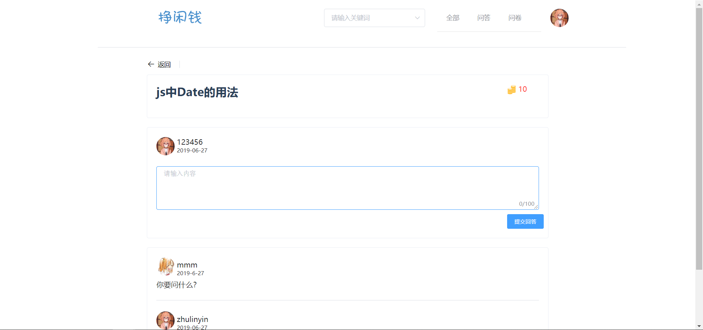
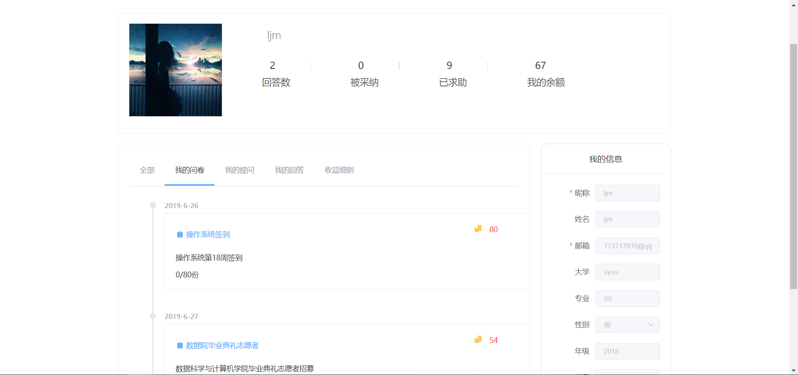
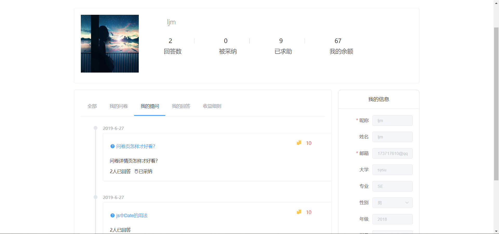
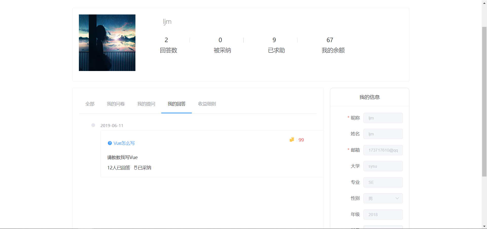
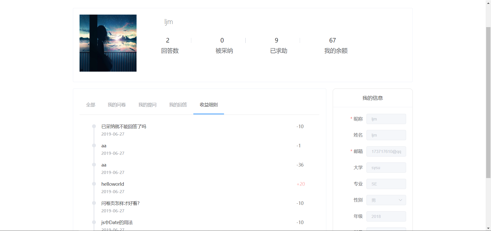

## 用户手册 

### 主页面 

- 可以查看全部类型/问卷类型/问答类型的任务
- 查看到任务的完成的情况与收益

### 登录注册 

- 注册自己的个性账户
- 登录后可以完成任务获得报酬
- 登录后可进行交易

### 发布任务 

#### 发布问卷 

- 发布调查问卷
  - 包含单选、多选、填空类型的问题

#### 发布问答 

- 发布问答任务
  - 可采纳一个回答作为最佳答案

### 完成任务 

#### 填写问卷

- 填写其他人发布的调查问卷
- 填写完毕可获得闲钱收益

#### 回答问答 

- 回答其他人发布的问答
- 若被采纳可获得闲钱收益

### 个人主页 

#### 管理问卷

- 查看用户发布的问卷

#### 管理提问

- 查看用户发布的问题

#### 管理回答 

- 查看用户回答过的问答

#### 修改个人信息 

#### 查看余额 

#### 收支明细 

- 查看因发布任务，完成任务而产生的收支记录

