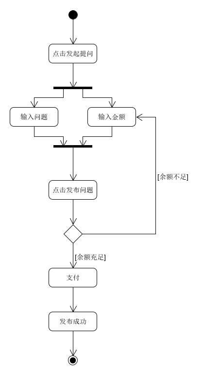

# 用例：发起提问

## 用例文本

|用例名称|发起提问|
|:-:|:-:|
|范围|Web网页|
|级别|用户目标|
|主要参与者|用户|
|涉众及其关注点|用户：希望他人帮忙解答问题|
|前置条件|用户登录到系统；用户了解提问流程|
|后置条件|用户填写问题内容；用户余额大于填写的金额|
|主成功场景|用户点击发起提问按钮；用户输入问题内容；用户输入悬赏金额；用户发布问题；系统从用户余额中扣除金额，将问题写入数据库|
|扩展|余额小于悬赏金额，提示余额不足|
|特殊需求||
|发生频率|经常发生|
|未决问题||

## 活动图
