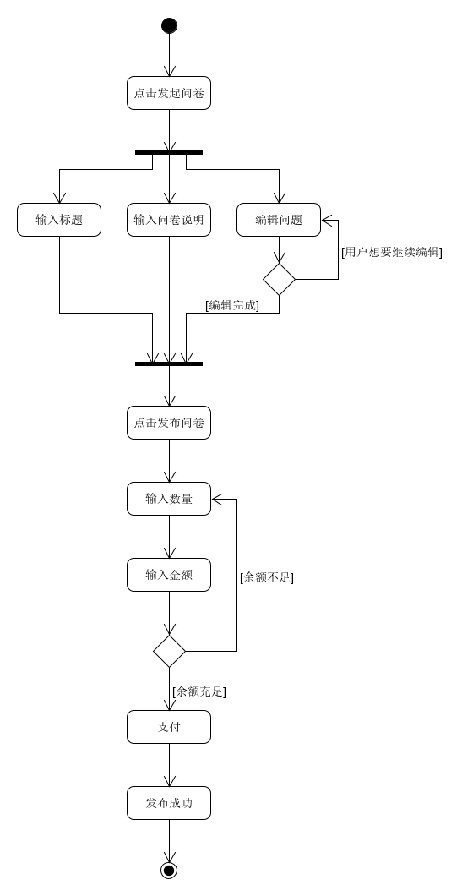

# 用例：发起问卷

## 用例文本

|用例名称|发起问卷|
|:-:|:-:|
|范围|Web网页|
|级别|用户目标|
|主要参与者|用户|
|涉众及其关注点|用户：希望他人帮忙填写问卷|
|前置条件|用户登录到系统；用户了解问卷编辑和发布流程|
|后置条件|用户输入问卷内容；用户余额大于问卷总金额|
|主成功场景|用户点击发起问卷按钮；用户输入问卷；用户输入问卷数量和每份的金额；用户发布问卷；系统从用户余额中扣除金额，将问卷写入数据库|
|扩展|余额小于总金额，提示余额不足|
|特殊需求||
|发生频率|经常发生|
|未决问题||

## 活动图
