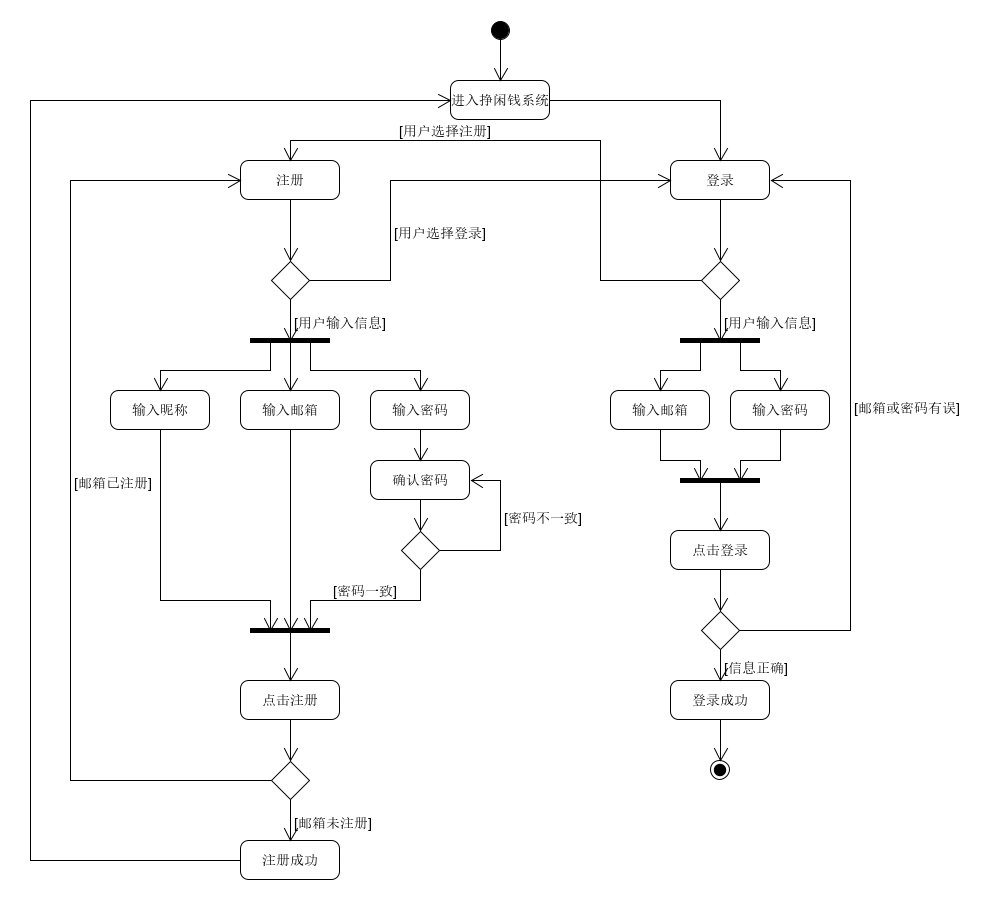

# 用例：注册登录

## 用例文本

|用例名称|注册登录|
|:-:|:-:|
|范围|Web网页|
|级别|用户目标|
|主要参与者|用户|
|涉众及其关注点|用户：希望能注册为挣闲钱平台的用户，登录系统发布任务或接收任务，获得收益|
|前置条件|用户了解登录注册的流程和需要填写的信息|
|后置条件|用户填写的信息无误，邮箱不与已有邮箱冲突|
|主成功场景|用户打开网页，填写昵称、邮箱和密码进行注册，邮箱不重复则注册成功；用户通过注册的邮箱和密码进行登录。|
|扩展|两次输入密码不一致，提醒密码错误；邮箱重复，提醒邮箱已注册。|
|特殊需求|界面美观，有明显的报错提醒|
|发生频率|经常发生|
|未决问题|邮箱验证问题|

## 活动图
