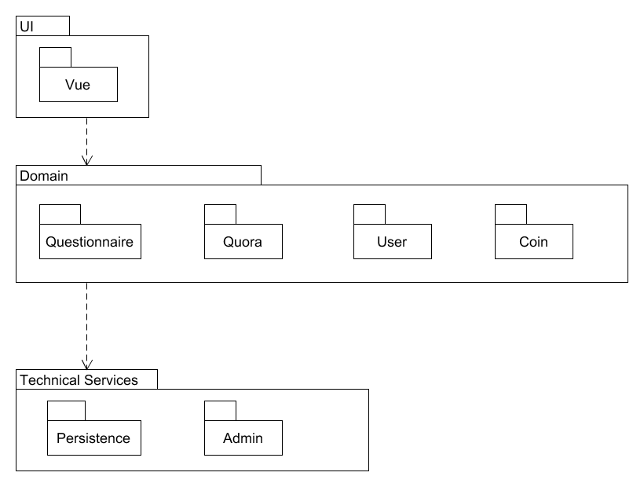
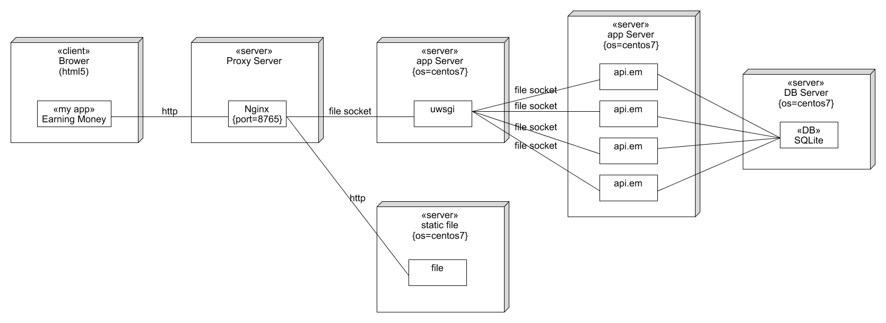

# 1. 技术选型及理由

## 1.1 前端

* 形式：Web
  
  理由：挣闲钱项目集成了发布任务、接受任务以及管理任务等多种功能。回答问题、填写问卷这类较为简单的功能，可以在小型设备上完成，但问卷设计、问卷数据统计等功能可能涉及大量的图表、数据的显示和交互，需要更大的屏幕和键盘鼠标等输入设备。因此我们选择了通用性较好，方便跨平台使用的Web端作为前端的形式。

* 框架：Vue
  
  理由：根据社区活力、文档完整性、编写难度以及团队成员的实际掌握情况，我们选择了Vue作为前端框架。

## 1.2 后端

* 语言：Python

  理由：

  - 学习简单，能快速进行开发构建 Web 应用。
  - 拥有丰富的标准库和第三方库。
  - 在WEB方面有多种成熟的框架。
  - 队友较为熟悉

* 框架：Django

  理由：
  
  - 学习简单，能进行快速开发的Python Web 框架。
  - 熟悉。

## 1.3 路由

nginx + uwsgi

理由：

- nginx是一个高性能的HTTP和反向代理web服务器
- uwsgi使得Django专注于提供服务

## 1.4 数据库

SQLite

理由：

- 轻量级
- 有足以实现本项目需求的功能
- Django框架自带, 不需要额外配置, 开发速度快

# 2. 架构设计

## 2.1 逻辑架构 

逻辑架构由四层模型（表示层、业务层、服务层、持久化层）构成。

### 2.1.1 表示层

用户端使用 Web 作为表示层, 提供问卷系统、问答系统、用户系统、闲钱交易系统

### 2.1.2 业务层

服务器充当业务层的角色, 为表示层的各个子系统提供相应的服务模块, 根据表示层系统来调用不同的服务模块

### 2.1.3 服务层

从各种数据访问对象检索和创建模型, 更新各个存储对象的值, 执行特定于程序的逻辑和操作等

### 2.1.4 持久化层

SQLite 提供了数据的持久化服务

## 2.2 架构问题

### 2.2.1 可靠性和可恢复性

- 因素：浏览器使用过程中出现访问服务端中断问题并进行恢复
- 度量和质量场景：当浏览器访问服务端中断时, 在正常的工作环境下, 如果在15s内检测到其恢复, 则重新建立连接
- 可变性：在能够重新建立连接之前, 可以在客户端进行简化服务
- 该因素对涉众、架构以及其他因素的影响 ：浏览器使用者的访问数据可能会发生丢失, 无法传递给服务端
- 对于成功的优先级 ：高
- 困难或风险：中等

### 2.2.2 可支持性和可适用性

- 因素：支持多种可变的第三方服务（支付系统等）
- 度量和质量场景：当浏览器访问第三方系统时可正常建立连接
- 可变性：对于不同的第三方服务需要可连接的接口
- 该因素对涉众、架构以及其他因素的影响 ：提高浏览器的可扩展性
- 对于成功的优先级 ：中等
- 困难或风险：中等

## 2.3 解决方案说明

### 2.3.1 如何提高服务端性能

- 提升服务端性能
  - 增加CPU数量
  - 增加内存
  - 增加程序使用线程数
- 限制同时服务的最多用户数, 避免服务端负载超荷
- 将动态数据存储到缓存文件中, 前端直接调用这些文件, 而不必再访问数据库
  - 比如已获取到的问卷可以保存在缓存中, 不必重复向服务端请求
- 优化数据库的查询SQL, 避免使用代价高昂的查询, 每次查询只返回自己需要的结果; 避免短时间内的大量SQL查询
- 数据库适当建立索引
- 数据库定期备份, 当数据库出现操作失误或系统故障导致数据丢失时可以恢复数据

## 2.4 逻辑视图 



## 2.5 物理视图 



# 3. 模块划分

## 3.1 前端

## 3.2 后端

- router

  负责将 HTTP 请求转交给合适的 controller 处理

  ```python
  urlpatterns = [
      path('', views.register, name='register'),
      path('session', views.session, name='session'),
      path('<int:t_uid>', views.getInfo, name='getInfo'),
      path('self', views.self, name='self'),
      path('password', views.changePassword, name='changePassword'),
      path('avatar', views.uploadAvatar, name='uploadAvatar'),
  ]
  ```

  

- controller

  处理 HTTP 请求，收集参数，进行简单的参数格式验证，并调用 service, 必要时要验证是否为登录用户

  ```python
  # 检查登录状态
  if 'login_id' not in request.session:
      return failMSG('no login')
  
  # 获取json数据
  try:
      rdata = json.loads(request.body)
  except Exception as e:
      return failMSG('get json data error')
  ```

  

- service

  处理业务逻辑, 分为几个小模块

  - account: 负责用户账户管理
  - assignment: 任务管理
  - questionnaire: 问卷管理
  - qa: 问答管理
  - coin: 闲钱管理

  ```python
  urlpatterns = [
      path('testdev/', include('testdev.urls')),
      path('account/', include('account.urls')),
      path('coin/', include('coin.urls')),
      path('assignment/', include('assignment.urls')),
      path('questionnaire/', include('questionnaire.urls')),
      path('qa/', include('qa.urls')),
      path('admin/', admin.site.urls),
  ]
  ```

  

- model

  负责与数据库的交互

  ```python
  class UserCoin(models.Model):
      Self = models.ForeignKey(User, on_delete = models.CASCADE, related_name = 'coins')
      Coin = models.IntegerField(default = 100)
  
      def __str__(self):
          return '%s: [%d]' % (self.Self.Nickname, self.Coin)
  ```

  

# 4. API设计

API 规范:[REST API](https://code-flows-in-you.github.io/Dashboard/08-02-RESTful-api-design-standard)

API 文档:[Swagger](https://code-flows-in-you.github.io/API-document/)


# 5.测试

- [测试方案](https://code-flows-in-you.github.io/Dashboard/09-01-Testing-plan)
- [后端api测试报告](https://code-flows-in-you.github.io/Dashboard/09-02-Backend-Api-Testing)

